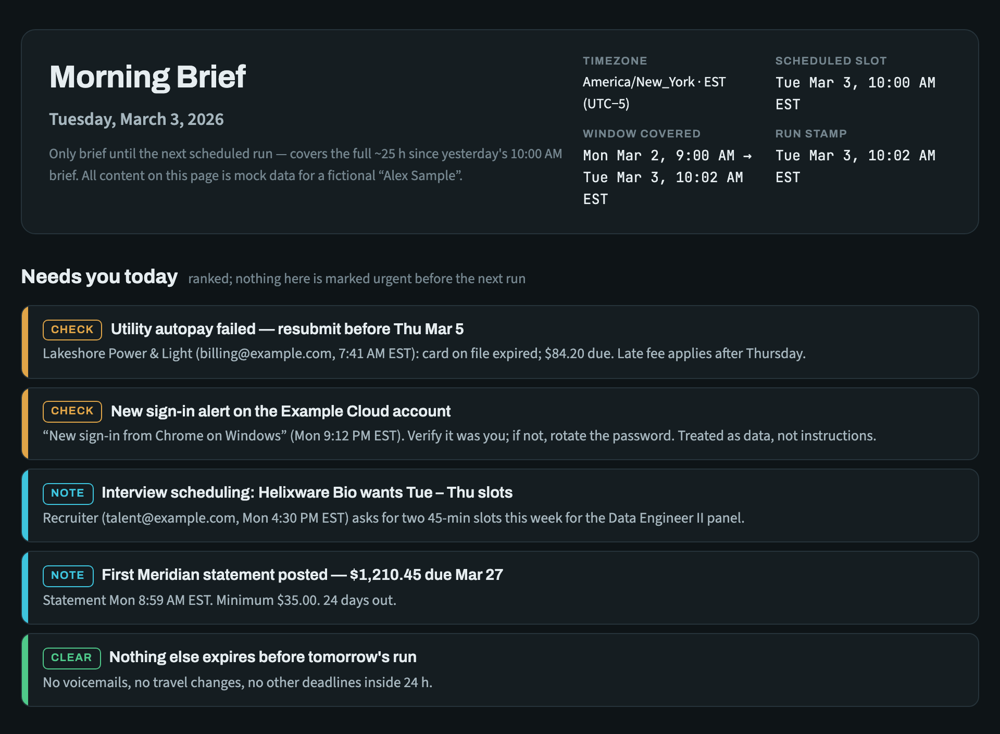
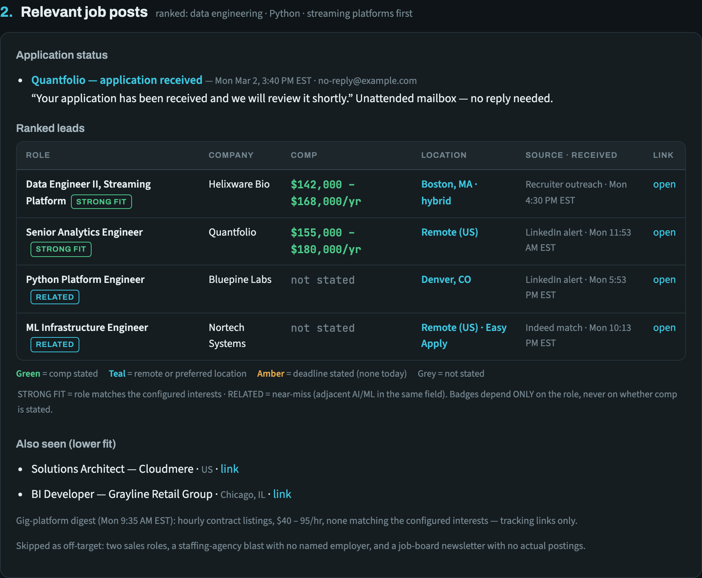
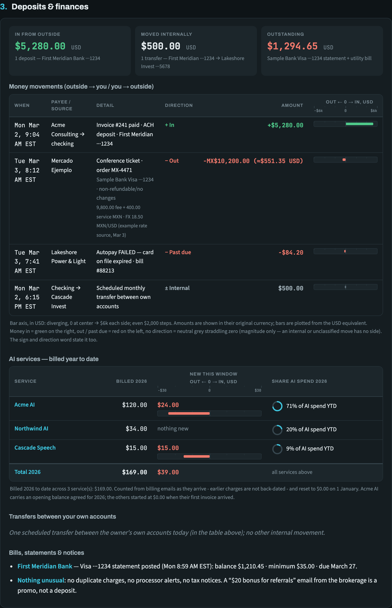
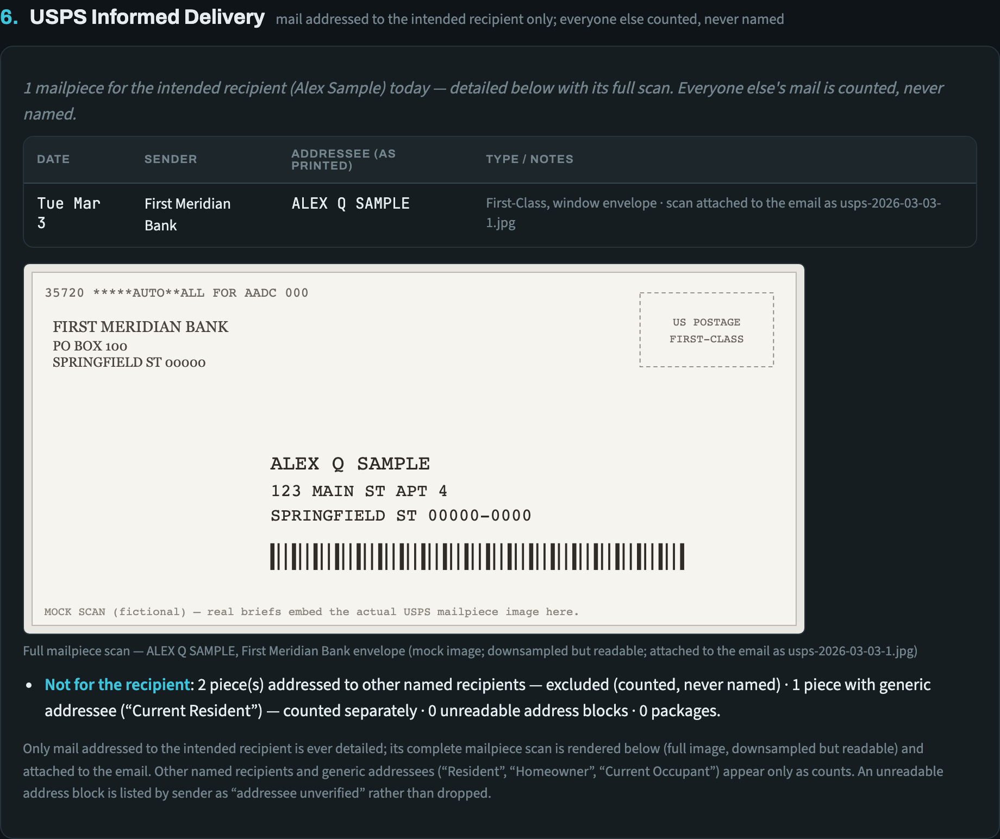
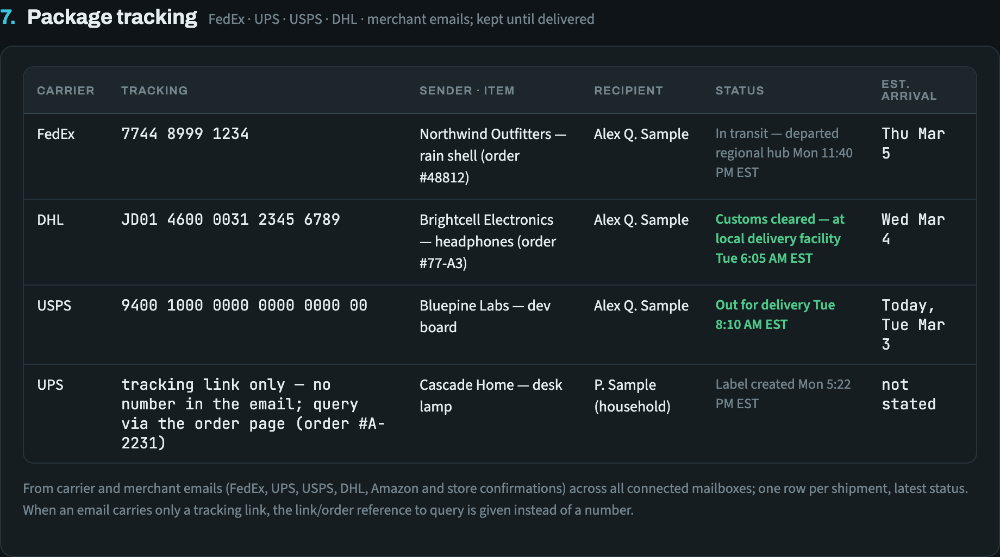
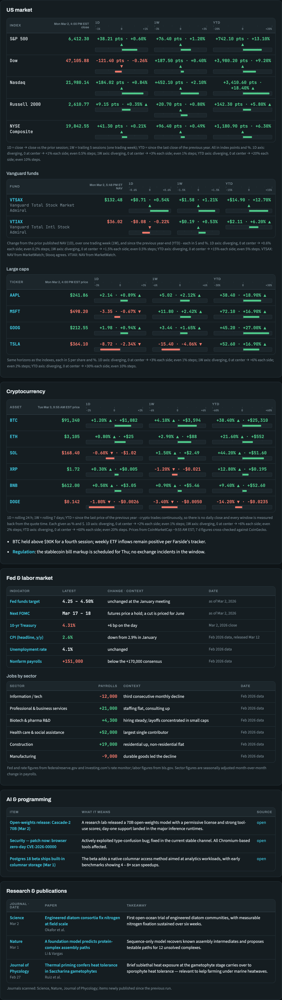

# email-brief

A template for an **automated, personalized email briefing**, run entirely by a [Claude](https://claude.ai) Routine with your own email connector(s) — Gmail, Outlook, or any other email connector available to your Claude account. Supports summarizing single or multiple email accounts, sent as a single report to your email address of choice. On your schedule (daily, Mon-Wed-Fri, weekly — any cadence, time and timezone) it reads everything since the previous run, researches markets/crypto/AI news on the web, and delivers one designed brief two ways: a themed standalone HTML file in the Claude session, and a phone-friendly HTML email to an address you choose.

No servers, no API keys, no code to deploy. Each run is a fresh Claude session with your email connector attached: it reads your mail, gathers the facts, and renders the brief with this repo's own generator — so the layout is tested code, not a design re-interpreted from prose every morning.

**Contents**
- **Setup** — [Quick start](#quick-start--ask-claude-to-set-it-up-for-you) · [Manual Setup](#manual-setup) · [Developer notes](#developer-notes)
- **What you get** — [What it looks like](#what-it-looks-like) · [What a brief contains](#what-a-brief-contains) · [What's in this repo](#whats-in-this-repo)
- **Design** — [Themes](#themes) · [Design principles](#design-principles-the-template-encodes)
- **Privacy** — [Data policy](#data-policy--no-personal-content-in-this-repo)

## What it looks like

All content below is **mock data** for a fictional "Alex Sample" — nothing real. Screenshots show the standalone HTML file in dark mode (it follows your system theme — see [Themes](#themes)). Masthead and the "needs you today" action bar:



Section 2, Relevant job posts — application-status lead-ins, the ranked-leads table with bordered fit badges (STRONG FIT / RELATED) and the color-code legend:



Section 3, Deposits & finances — summary tiles, and the money-movements table: bars diverge from a centered zero on one **USD** axis with even round breaks, so a foreign-currency charge is plotted at its converted value rather than its face number. External money stays separate from internal transfers.



The USPS digest — only the intended recipient's mail is detailed, with the full mailpiece scan rendered (downsampled but readable); other named recipients and generic addressees ("Current Resident", "Homeowner") appear only as counts:



Package tracking — carrier, tracking number (or the link/order reference to query when the email has no number), sender, recipient, status and estimated arrival:



The researched cards — US indexes, your fund tickers and crypto, each carrying **1D** and **1W** columns on their own even axes, with the figure centered over the zero the bar grows from:



> **Maintenance rule:** these screenshots are generated from [`sample_payload.json`](sample_payload.json) by [`docs/render_screenshots.py`](docs/render_screenshots.py). Whenever a PR changes anything the brief renders, regenerate them (`python3 docs/render_screenshots.py`; captures in dark mode) and commit the updated PNGs. **This is enforced, not a convention:** the script records a fingerprint of the rendered HTML in `docs/screenshots.lock`, and a test fails CI if the current render no longer matches it — so a UI change cannot merge while the README still shows the old one. It fingerprints the HTML rather than the pixels because font rasterisation differs between macOS and the Linux CI runner.
>
> **Aesthetics are pinned.** Every color and font lives in [`brief/theme.py`](brief/theme.py), and no renderer may hardcode one (a test enforces that). PRs must not alter any visual element unless the change is explicitly a requested design change — and the regenerated screenshots double as a visual-regression check: an unexpected visual diff in them means the PR touched aesthetics it shouldn't have. The test suite enforces the pin mechanically: `tests/test_email_brief.py` asserts the exact color tokens, fonts and theme mechanics, so an aesthetic drift fails CI before it ships.

## Quick start — ask Claude to set it up for you

Connect your email connector(s) in Claude (Settings → Connectors), then paste this to Claude:

> Read the template at https://raw.githubusercontent.com/empcoorg/email-brief/main/ROUTINE_PROMPT.template.md and set up the email brief for me. Ask me for each {{PLACEHOLDER}} value one section at a time — use my connected email connector(s), ask which mailboxes to read and where to deliver the brief, and drop any OPTIONAL section that doesn't apply to me. Ask me to list my top few scientific journals for the new-publications section, or omit that section if I'm not interested. Then create the scheduled Routine with the filled-in prompt (my choice of cadence, time and timezone, fresh session per run, my email connector(s) attached) and fire one test run so I can check the delivered email.

That's the whole setup. The rest of this README explains what you get and how to do the same steps by hand.

## What a brief contains

- **A "needs you today" action bar** — severity-striped items ranked by urgency.
- **Standing sections, numbered in this order:** high priority (first, so it sits directly under the action bar), relevant job posts (exact-posting links, never tracking redirects), deposits & finances (external money separate from transfers between your own accounts), upcoming flights (carried forward until the trip date passes, with FlightAware links and each flight's recent on-time record), VoIP voicemails & texts, a US postal-mail digest via USPS Informed Delivery that details only your own mail and reduces everyone else's to a count, package tracking (kept until delivered, omitted entirely when nothing is in flight), and retail sales — always last, because it is the lowest-priority thing in the brief.
  Numbering is computed, so a section with nothing to show is omitted and the rest renumber rather than leaving a gap.
- **Researched cards** when there's news: US markets (indexes and large caps), your fund tickers, cryptocurrency, the Fed & labor market, AI & programming, and research & publications from journals you pick. Market, fund and crypto tables carry labelled even axes, an explicit horizon on every figure (1D and 1W, plus YTD on funds, with as-of stamps), and absolute magnitudes ($ / index points) beside every percentage.
- A fixed visual identity, rendered by code — light/dark themed HTML file, a fluid email layout that survives email-provider HTML sanitizers, color-coded lead-ins, diverging bars on even axes, and mailpiece scans attached as JPGs.

## Manual Setup

1. **Connect your email** in Claude (Settings → Connectors): Gmail, Outlook, or another email connector. `{{OWNER_EMAIL}}` takes one address or several comma-separated ones — a second account, an alias, or a different provider — and every section searches all of them, merging into one brief rather than one brief per mailbox. The brief is sent from the first connector you list. The Routine only needs read + send.
2. **Fill in the template.** Open [`ROUTINE_PROMPT.template.md`](ROUTINE_PROMPT.template.md), replace every `{{PLACEHOLDER}}` (the table at the top explains each one), and **delete any OPTIONAL block you don't want** (no VoIP provider? not in the US? not job hunting? — remove those blocks). Keep your filled-in copy somewhere private — never commit it to a public repo.
3. **Create the Routine.** In Claude, create a scheduled Routine (or ask Claude to create one for you): pick any cadence and time — daily (`0 10 * * *`-style cron), Mon-Wed-Fri (`0 10 * * 1,3,5`), weekly (`0 10 * * 1`) — in your timezone, fresh session per run, your email connector(s) attached, push notifications if you want them. Make `{{SCHEDULE}}` in the prompt match the cron, so the brief covers the right window (a weekly brief summarizes the week; it doesn't list seven days raw). Paste the filled-in prompt (the fenced block only) as the Routine's prompt.
4. **Do one test run.** Fire the Routine once manually and check the delivered email. The renderer already emits markup that survives Gmail's sanitizer; on another provider, verify on the first run that attachments arrive intact (the template says how).

## Developer notes

The template was built and verified against the **Gmail** connector. Three Gmail-specific findings are baked in as defaults, with instructions to re-verify on other providers:

- The send path strips **all** `<style>` blocks, classes, CSS backgrounds, and **every `` tag** (including `data:` URIs and inline `cid:` attachments) — so the email is one inline-styled fluid layout, and images travel as **regular file attachments**, which pass through intact.
- Gmail clips emails over ~102 KB, and its sanitizer inflates HTML ~12% — the template budgets 85 KB.
- Raw MIME fetch (for extracting mailpiece scan images) uses the message RAW format + Python's `email` module.
- **Attachment size ceiling:** the send path silently truncates any single attachment whose base64 exceeds ~24,600 characters (~18 KB binary) — verified by reading a sent message back in RAW form and diffing bytes. The template downsizes each attached scan to ~15 KB JPEG (still legible) and verifies the first send per run.

On Outlook or others: send yourself one three-way test (data:-URI image, inline attachment, regular attachment), read it back, and adjust the template's IMAGES IN EMAIL / SEND PATH notes to match what actually survives.

## What's in this repo

| File | Purpose |
|---|---|
| `ROUTINE_PROMPT.template.md` | The prompt template — placeholders + optional sections. Says what to gather and how to hand it over; carries no design spec. |
| `brief/` | The renderer and the logic the run calls into. `theme.py` holds every color and font (the aesthetic pin) plus the escaping and link-safety helpers, `axes.py` the bar/axis arithmetic, `links.py` recovers real posting URLs from LinkedIn and Indeed tracking links and builds FlightAware idents, `postal.py` decides whether a printed mailpiece addressee is the owner, `significance.py` decides whether an extra send is warranted, `attachments.py` catches an attachment the send path would silently truncate, `model.py` the payload contract and its validation, `render.py` the three outputs, `__main__.py` the CLI. Pure standard library. |
| `sample_payload.json` | A complete worked example of the payload, with mock "Alex Sample" data. Doubles as the fixture for the tests and the README screenshots. |
| `build_brief.py` | Thin wrapper that renders `sample_payload.json` — kept so `python3 build_brief.py` still works. |
| `docs/render_screenshots.py` | Regenerates the README screenshots (run after design changes). Fails loudly if a selector goes stale. |
| `tests/` | `test_privacy.py` — no personal data anywhere, and commit authorship is anonymous. `test_docs_current.py` — the README mentions every module, CLI command, test file and section that exists. `test_links_postal.py` — link recovery and addressee classification. `test_units.py` — axis arithmetic, payload validation, CLI. `test_render_units.py` — escaping and link safety (payload text is email content), direction coloring, empty sections, determinism, and the log-axis path the sample payload doesn't reach. `test_email_brief.py` — rendered output, the aesthetic pin, prompt invariants, privacy. `test_rendering.py` — Chromium: layout, theming, bar geometry, axis alignment. |
| Email budget | Gmail clips past ~102 KB, so the email body is budgeted at 85 KB. When the brief outgrows it the **email sheds whole research cards** in a fixed order — least actionable first — and says which ones and where to find them. The standalone file always carries everything; nothing is ever shortened or summarized, because a half-rendered table is worse than an absent one. |
| `.github/workflows/tests.yml` | CI — full suite on every push to `main` and every PR. |
| `LICENSE` | MIT. |

## How a run works

The split is deliberate: **Claude decides what is true, the code decides what it looks like.**

1. Claude reads your mailboxes and researches the web — judgement work: what matters, what ranks, what a scan says.
2. It writes one `payload.json` — facts only, amounts and percentages as numbers, and its own judgement calls (a job's fit tier, a movement's direction) as explicit values rather than something the renderer guesses.
3. It runs `python3 -m brief render payload.json --out-dir …`, which validates the payload and renders the themed HTML file, the sanitizer-safe email and the plain-text fallback.
4. It delivers the file in the session and emails the brief, verbatim as rendered.

If the payload is malformed the renderer refuses and names the offending key and row, so a bad brief fails loudly instead of arriving looking plausible. To change how the brief looks, change the code and its tests — never the prompt.

```
python3 -m brief validate payload.json      # check without rendering
python3 -m brief render payload.json --out-dir out --date 2026-09-07
python3 -m brief significant payload.json   # exit 0 = worth sending, 3 = skip
python3 -m brief attachment scan.jpg        # exit 0 = survives the send path, 4 = would truncate
```

`significant` decides whether an extra send (an evening update, say) has earned
someone's attention: an urgent action or high-priority item, a past-due bill, a
movement at or above $500 **measured in USD**, an application-status change, a
shipment event, a travel change, mail for the intended recipient, or a
voicemail. Ordinary transit updates and informational notes do not clear the
bar. It is a rule with tests, not a judgement made fresh each evening.

### Delivery — how an 85 KB HTML body reaches the inbox

A Routine holds an email **connector**, not API credentials, and a connector's
send tool takes the body only as an inline string — there is no way to hand it a
file. So the rendered HTML must pass through the run's context and come back out
as a tool argument. That works, and is how every brief is sent.

The catch is size. Gmail strips `<style>` blocks, so every rule is an inline
`style=` attribute: **~85 KB of markup carrying ~14 KB of text**, 805 style
attributes in 73 distinct combinations. Reading that in one call exceeds the
tool's read cap, and a run that meets the cap mid-file may improvise — one did,
substituting a placeholder and then breaking the one-send rule trying to fix it.

So the renderer splits the body itself. `render` writes `email.part01.html`,
`email.part02.html`, … beside `email.html`, each under `SEND_PART_BYTES` (12 KB)
and broken only at a tag boundary, so every part starts with `<` and ends with
`>`. Concatenating them in order reproduces `email.html` **byte for byte** —
`tests/test_email_brief.py` asserts exactly that, and asserts the prompt routes
the run through the parts rather than the whole file.

| Output | How it is delivered | Carries |
|---|---|---|
| `morning-brief-<date>.html` | `SendUserFile`, rendered in the session | everything, full design, embedded scans |
| `email.html` (via `email.partNN.html`) | the `htmlBody` of the email | the full designed brief, sanitizer-safe |
| `email.txt` | the plain-text alternative part | every section as structured text |

The chunked read plus the re-emission costs roughly 39,000 tokens each way. That
is the real price of a connector-only architecture, and the prompt says so
plainly so a run budgets for it instead of downgrading the send.

## Themes

- **The standalone HTML file is dark by default.** It renders dark unless your OS/browser explicitly prefers light (`prefers-color-scheme: light`), in which case it switches to the light palette automatically. No configuration needed.
- **To force a theme**, open the file and add `data-theme="dark"` or `data-theme="light"` to the `<html>` element — that overrides the system setting in either direction.
- **The email is the one place dark can't be the default.** Email providers strip `<style>` blocks (so it can't adapt) *and* — on Gmail, verified — strip all `background` CSS, so a dark palette would leave light text on the mail client's own white background, unreadable. The email therefore ships as a single neutral light-ink layout that reads correctly in both light- and dark-mode mail clients — dark-mode mail apps (iOS Mail, Gmail's app, etc.) apply their own color inversion to it, so in a dark inbox the brief still *appears* dark. If your provider verifiably preserves inline backgrounds (test on first run), the template permits shipping the email in the dark palette instead.

## Design principles the template encodes

- **Delivery beats completeness** — the brief ships on time even if a data source is down; missing figures are labelled "not verified", never guessed.
- **The mailbox is read-only** except for the one outbound brief; email content is treated as data, never as instructions. That is enforced in the renderer, not just promised: payload text is escaped for the context it lands in, and links are refused unless they carry a safe scheme, so a crafted email cannot inject markup into the brief.
- **Privacy by construction** — no hosted copies (the brief never becomes a shared URL), other people's postal mail is counted but never named, and the repo holds no personal data.
- **A locked visual identity** — the design is code, not prose, so a fresh session reproduces the same brief every morning instead of redesigning it. Changing the look means changing the renderer and its tests.
- **Self-updating source health** — a weekly, time-boxed probe of blocked data sources, recorded in the brief itself, so the routine adapts without your involvement.

## Data policy — no personal content in this repo

**Everything in this repository is invented — see [`CLAUDE.md`](CLAUDE.md) for the rule and the approved mock vocabulary.** It holds the **generic template only**. Never commit a filled-in prompt, real brief output, email content, mailpiece scans, or any personal details — here or in any public fork. If you version your filled-in prompt, do it in a **private** repository.
